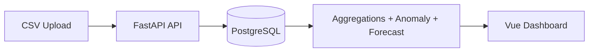

# ShadowPlant AI (MVP)

Factory Performance Intelligence MVP with FastAPI + Vue.

## Architecture
- `backend/app/domain`: entities + anomaly/forecast domain logic
- `backend/app/application`: use-cases/DTO orchestration
- `backend/app/infrastructure`: SQLAlchemy models/repos/security/logging/metrics
- `backend/app/api`: routers/dependencies/schemas

## Setup
1. Copy `.env.example` to `.env`.
2. `docker compose up --build`
3. `make migrate && make seed`
4. Open UI at `http://localhost:5173`

Default users:
- admin/admin123
- viewer/viewer123

## Commands
- `make dev` start full stack
- `make migrate` run Alembic
- `make seed` generate 6 months synthetic data
- `make test` run backend tests
- `make lint` run ruff + black checks

## API Highlights
- `POST /auth/login`
- `POST /datasets/upload` (admin only)
- `GET /datasets`
- `GET /kpi/overview?date=YYYY-MM-DD`
- `GET /kpi/machines?from=YYYY-MM-DD&to=YYYY-MM-DD`
- `GET /anomalies?from=...&to=...&severity=high&limit=50&offset=0`
- `GET /forecasts?machine_id=M-100&horizon_days=3`
- `GET /insights?date=YYYY-MM-DD`
- `GET /metrics`

OpenAPI tags/examples are available at `/docs`.

## Security/OWASP alignment (MVP)
- JWT auth + role guard for mutation endpoints
- input validation via Pydantic + CSV schema checks
- upload size/row limits
- pagination bounds on list endpoints
- rate limiting via `slowapi`

## Demo Script (sales)
1. Login as `admin`.
2. Upload `backend/sample_data/sample_shift_a.csv` and `sample_shift_b.csv`.
3. Open dashboard and show KPI cards + trends.
4. Show anomalies and drill into worst machines.
5. Call `/insights` to narrate deterministic AI summary.

## Notes
- Logs are JSON to stdout.
- Environment-driven config only.
- Optional future extension: OpenAI insight generation adapter (disabled by default).
